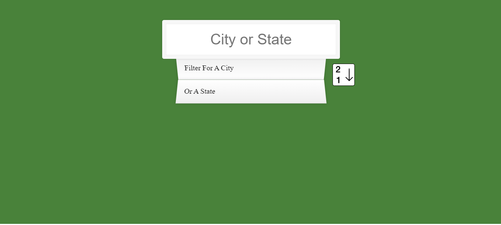
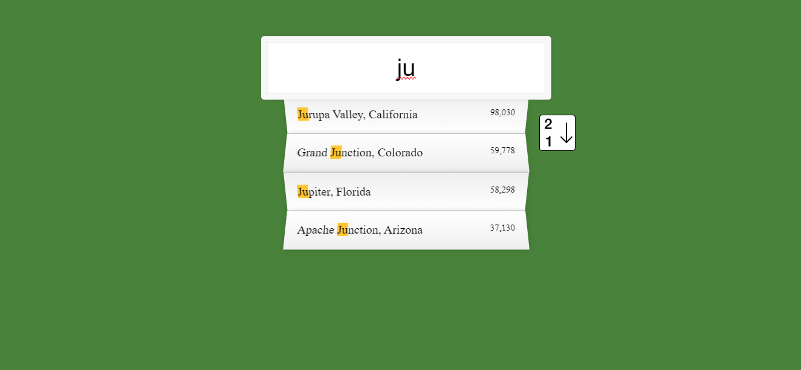
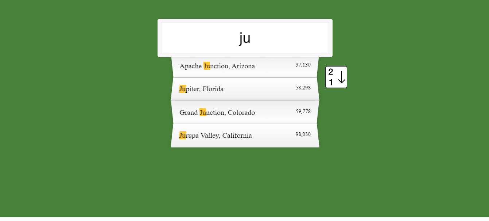

# City, States and Populations

## Table of contents

- [Overview](#overview)
  - [The challenge](#the-challenge)
  - [Screenshot](#screenshot)
  - [Built with](#built-with)
  - [What I learned](#what-i-learned)
- [Author](#author)


## Overview

This is search tool that allows the user to search all the states and cities in the US 
and see the population for each one. The search will highlight the inputted text in 
the search results and order the results by population highest to lowest. There is
a button to reverse the order to lowest to highest population with an animated icon
on hover.


### The challenge

Users should be able to: 

- Search for any state or city in the USA with a population higher than 35,000
- See the results ordered highest to lowest and be able to reverse the list
- See the searched for text highlighted in the results within the list


### Screenshot






### Built with

- HTML5
- CSS
- JavaScript


### What I learned

I learned how to fetch data from a URL, process the data by using .json and then 
extract the raw data and put it in a variable that could be accessed by functions.
In my code I use the spread function to avoid nesting the newly formed data array 
in the empty array. 

The first function has two arguments, a word to match and the cities array. The function
filters the cities array with a regular expression, returning matches to the searched for
characters / word. The filter is global, so it returns all occurances of the search content 
and its case insensitive. 

The second function creates the list of matches by mapping the array provided by the first
function. It also swaps out the searched for characters in the returning html for a set of 
span tags that will provide the highlighted text. Finally it puts all of the data into the HTML
by assigning the inner HTML of the suggestions list as the mapped array.

The reverse function works in the same way but the array to be mapped is reversed before mapping.

```js
const cities = [];
fetch(endpoint) //fetch the data from the url saved in the variable endpoint
    .then(rawData => rawData.json()) //get the raw data and turn in it into json to call the next promise on
    .then(data => cities.push(...data)) //extract raw data and push as a spread into the array
                                        
function findMatches(wordToMatch, cities) {
    return cities.filter(place => {
        const regex = new RegExp(wordToMatch, 'gi');
        return place.city.match(regex) || place.state.match(regex)
    });
}
function displayMatches() {
    const matchArray = findMatches(this.value, cities);
    const html = matchArray.map(place => {
        const regex = new RegExp(this.value, 'gi');
        const cityName = place.city.replace(regex, `<span class="hl">${this.value}</span>`);
        const stateName = place.state.replace(regex, `<span class="hl">${this.value}</span>`);
        return `
        <li>
            <span class="name">${cityName}, ${stateName}</span>
            <span class="population">${numberWithCommas(place.population)}</span>
        </li>
        `;
    }).join('');
    suggestions.innerHTML = html;
}   
```


## Author
- Lee Trewhitt
- Website - https://leetrw.github.io/


