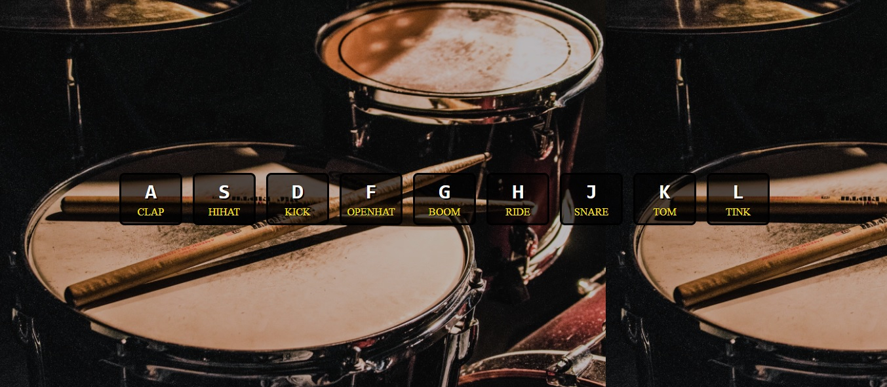
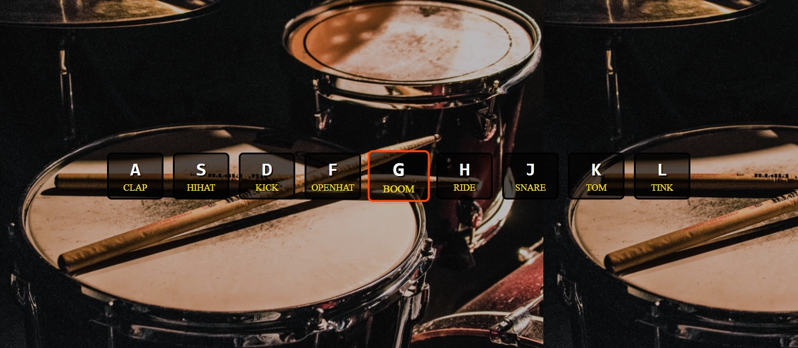

# Keyboard Drum Kit

## Table of contents

- [Overview](#overview)
  - [The challenge](#the-challenge)
  - [Screenshot](#screenshot)
  - [Built with](#built-with)
  - [What I learned](#what-i-learned)
- [Author](#author)


## Overview

This is a webpage that allows users to press keys on the keyboard and play 
the corresponding drum sound listed on the screen. I used this as a chance 
to use an object in JavaScript which links keyboard keys to actions and DOM elements.
Each key (e.g., 'A', 'S', 'D', etc.) in the object is associated with an action 
(like 'clap', 'hihat', 'kick', etc.) and a DOM element (retrieved using
document.querySelector) representing the corresponding key on the webpage.


### The challenge

Users should be able to: 

- Press the stated keys to play the drum sound linked with that key.


### Screenshot





### Built with

- HTML5
- CSS
- JavaScript


### What I learned

In this projct I learnt about JavaScript objects and how to link keyboard keys
to actions and DOM elements. Each key in the object is associated with an action 
and a DOM element representing the corresponding key on the webpage. The function 
below takes the key pressed and extracts the action from the linked object and 
then executes that action (in this case play the corresponding sound). It also 
adds a class for a 100ms which highlights the key pressed on the screen.

```js
const keyActions = {
    'A': { action: 'clap', element: document.querySelector('.keyA') },
}
 function playAndSound(key) {
    const { action, element } = keyActions[key];
    if (element) {
      element.classList.add('playing');
      setTimeout(function() {
        element.classList.remove('playing');
      }, 100);
    }
    if (action) {
        let audio = new Audio('resources/sounds/' + action + '.wav');
        audio.play();
    }
  }
  
  document.addEventListener('keydown', function(event) {
    const key = event.key.toUpperCase();
    playAndSound(key);
  });
```

## Author
- Lee Trewhitt
- Website - https://leetrw.github.io/