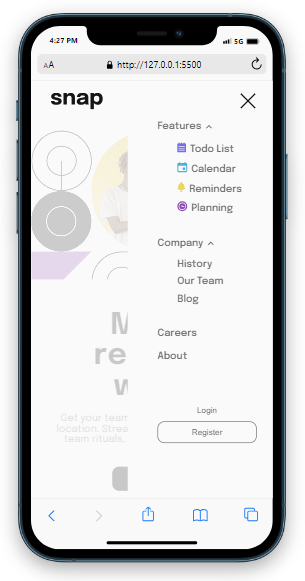

# Snap Landing Page

## Table of contents

- [Overview](#overview)
  - [The challenge](#the-challenge)
  - [Screenshot](#screenshot)
  - [Built with](#built-with)
  - [What I learned](#what-i-learned)
- [Author](#author)


## Overview

This is an example landing page for a business called snap. It is a responsive page 
that will swap the traditional horizonatal navigation bar for a slide in mobile
menu when the screen size gets to the correct size. Within the menu there are also
two submenus that will become visible when the related navigation element is clicked.
On the large screen version the submenus will appear below the top nav bar and in the 
mobile menu they will appear inline and shift the rest of the menu down.


### The challenge

Users should be able to:

- View the relevant dropdown menus on desktop and mobile when interacting with the navigation links
- View the optimal layout for the content depending on their device's screen size
- See hover states for all interactive elements on the page


### Screenshot





### Built with

- HTML5
- CSS
- Flexbox
- JavaScript


### What I learned

Nothing in this project was new to me although it was good practice, helping
cement some fundamentals of CSS. Below was the first time I'd had need of the 
orientation feature in the media query. Below fixes an issue within the mobile
menu, where in landscape mode the menu would exceed the limits of its container
when submenus were opened.

```css
@media screen and (max-width: 800px) and (orientation: landscape) {
    nav {
        height: fit-content;
        padding-bottom: 3rem;
    }
}
```

## Author
- Lee Trewhitt
- Website - https://leetrw.github.io/


