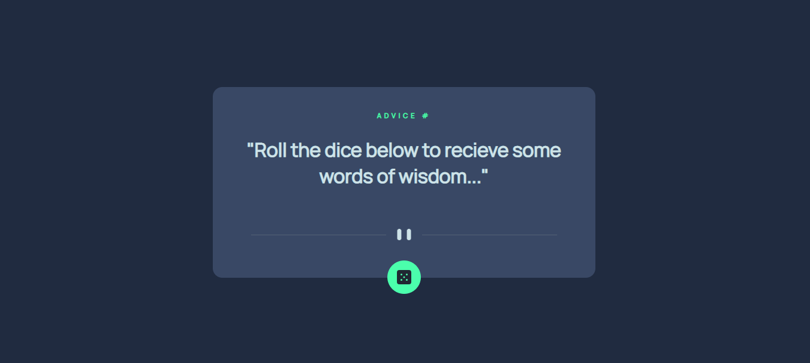

# Advice Generator

## Table of contents

- [Overview](#overview)
  - [The challenge](#the-challenge)
  - [Screenshot](#screenshot)
  - [Built with](#built-with)
  - [What I learned](#what-i-learned)
- [Author](#author)


## Overview

This is an advice generator that uses JavaScript to fetch a piece of advice 
and its ID number from a URL api. The user needs only to click the dice icon to 
generate a piece of advice, upon clicking the dice the component will display the 
advice and its ID number. If clicked again both parts will be exchanged for a new
set.   


### The challenge

Users should be able to: 

- View the optimal layout for the app depending on their device's screen size
- See hover states for all interactive elements on the page
- Generate a new piece of advice by clicking the dice icon


### Screenshot




### Built with

- HTML5
- CSS
- JavaScript


### What I learned

This project gave me chance to practice using fetch with promises to extract data 
from an API. The api returns a simple 'slip' object that I extract the ID and advice
from and put straight into the HTML within the function. 

```js
const endpoint = 'https://api.adviceslip.com/advice';

function extract() {

    const adviceId = document.querySelector('.number');
    const adviceQuote = document.querySelector('.advice');

    fetch(endpoint)
        .then(rawData => rawData.json())
        .then(data => {
            adviceId.innerHTML = data.slip.id;
            adviceQuote.innerHTML = data.slip.advice;
        })
}

const dice = document.querySelector('.dice');

dice.addEventListener('click', extract);
```

## Author
- Lee Trewhitt
- Website - https://leetrw.github.io/


