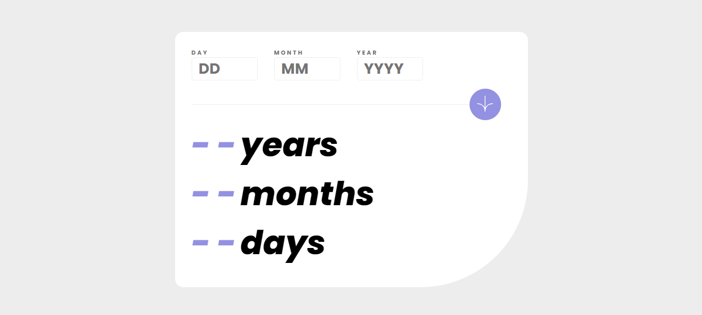
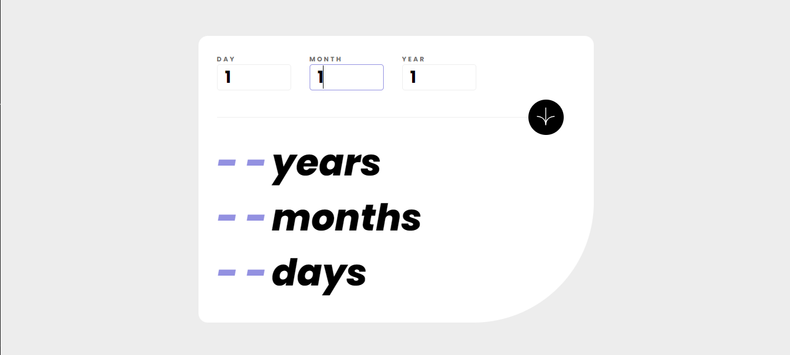
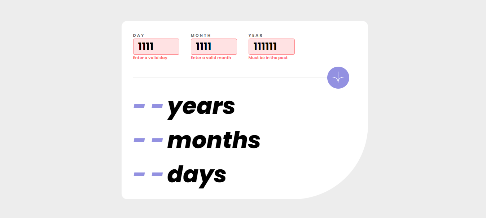
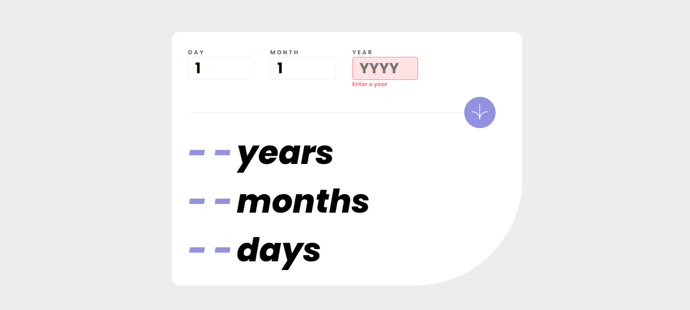
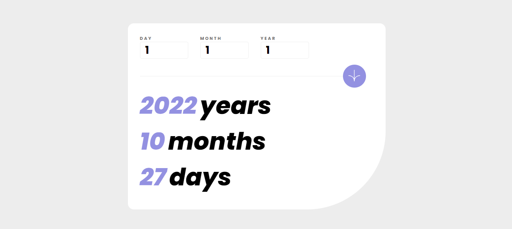
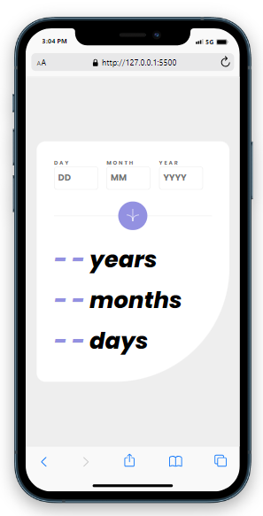

# Age calculator

## Table of contents

- [Overview](#overview)
  - [The challenge](#the-challenge)
  - [Screenshot](#screenshot)
  - [Built with](#built-with)
  - [What I learned](#what-i-learned)
- [Author](#author)


## Overview

This is an age calculator where a user can submit a valid past date and the number
of years, months and days between the current date and the given date will be shown.
The calculator will animate the time between the dates by counting up through the numbers.
The user must enter a date before the current days date as well as a month and corresponding
day that fit within the Gregorian Calendar. If a user fails to do so they will be prompted
to change their inputs.


### The challenge

Users should be able to:

- View an age in years, months, and days after submitting a valid date through the form
- Receive validation errors if:
  - Any field is empty when the form is submitted
  - The day number is not between 1-31
  - The month number is not between 1-12
  - The year is in the future
  - The date is invalid e.g. 31/04/1991 (there are 30 days in April)
- View the optimal layout for the interface depending on their device's screen size
- See hover and focus states for all interactive elements on the page
- See the age numbers animate to their final number when the form is submitted


### Screenshot









### Built with

- HTML5
- CSS
- Flexbox
- JavaScript


### What I learned

The biggest learning curve from this project was during the calculation stage after 
verifying that the date was valid. I started by calculating the amound of days  between 
the current date and the given date. If this number is +1 then the if statement will 
change the HTML from days to day. Next it checks if the result is a negative number, if so,
it will add one to a variable named minusMonths. This will be added to the input months
to reduce the total month difference to account for the lack of days. Finally if the 
number is positive and larger than one it will simply calculate the difference and
edit the HTML. The same will be done for the months and take the years into account if the number 
is a negative between the given month and current month. 

Joined with these calculations there is a function that will count up from 0 to the 
resulting time difference between the given date and the current date. It was 
difficult to work out how to make sure all the counters counted at an even pace 
regardless of the input. I made a few variables to split the result down into 
increments by dividing the end result by the duration. Then I increase the results evenly
with a setInterval function over the designated time.

```js
if ((thisDate - dayInput) === 1) {
        dayOutput.innerHTML = '1';
        dayWording.innerHTML = 'day';
    } else if ((thisDate - dayInput) < 0) {
        minusMonths = 1;
        calcDays = (thisDate + daysInMonth[thisMonth - minusMonths - 1]) - dayInput;
        dayOutput.innerHTML = animateCount(calcDays, 2, 'day-output');
        dayWording.innerHTML = 'days';
    } else {
        dayOutput.innerHTML = animateCount((thisDate - dayInput), 2, 'day-output');
        dayWording.innerHTML = 'days';
    }
   
    calcMonths = monthInput + minusMonths;

    if ((thisMonth - calcMonths) === 1) {
        monthOutput.innerHTML = '1';
        monthWording.innerHTML = 'month';
    } else if ((thisMonth - calcMonths) < 0) {
        minusYears = 1;
        monthOutput.innerHTML = animateCount((thisMonth + 12 - calcMonths), 2, 'month-output');
    } else {
        monthOutput.innerHTML = animateCount((thisMonth - monthInput), 2, 'month-output');
    }

    calcYears = yearInput + minusYears;

    if ((thisYear - calcYears) === 1) {
        yearOutput.innerHTML = '1';
        yearWording.innerHTML = 'year';
    } else {
        yearOutput.innerHTML = animateCount((thisYear - calcYears), 2, 'year-output');
        yearWording.innerHTML = 'years';
    }


    function animateCount(end, duration, elementId) {
    const frames = 60; // Number of frames per second
    const framesNeeded = frames * duration; // Total frames needed for the duration
    const increment = end / framesNeeded; // Calculate the increment per frame
    const elementToChange = document.getElementById(elementId);
    let current = 0;
    let frameCount = 0;

    const interval = setInterval(() => {
        if (frameCount >= framesNeeded) {
            clearInterval(interval);
            elementToChange.innerHTML = end;
        } else {
            current += increment;
            elementToChange.innerHTML = Math.round(current); // Round for whole numbers
            frameCount++;
        }
    }, 500 / frames); // Set interval based on frames
}
```

## Author
- Lee Trewhitt
- Website - https://leetrw.github.io/


