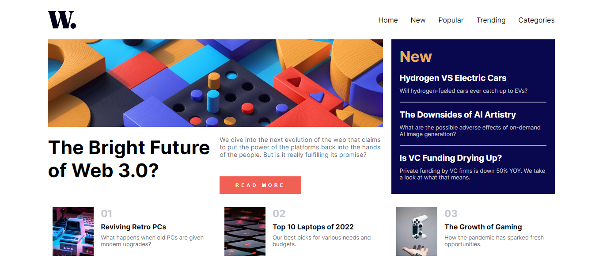
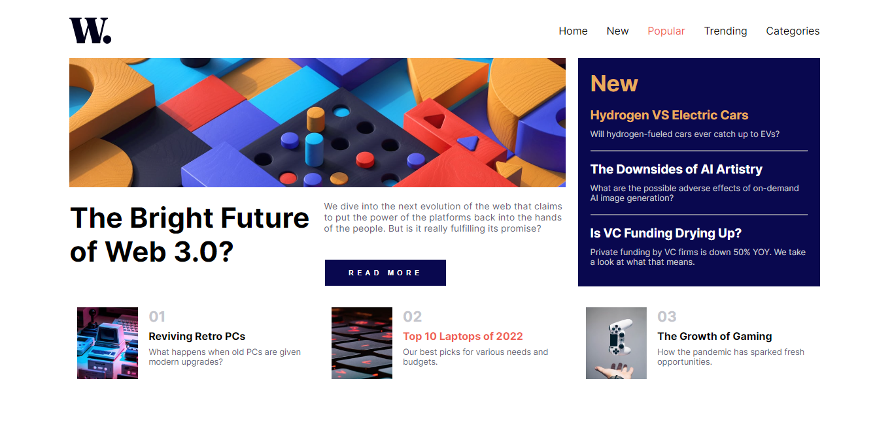
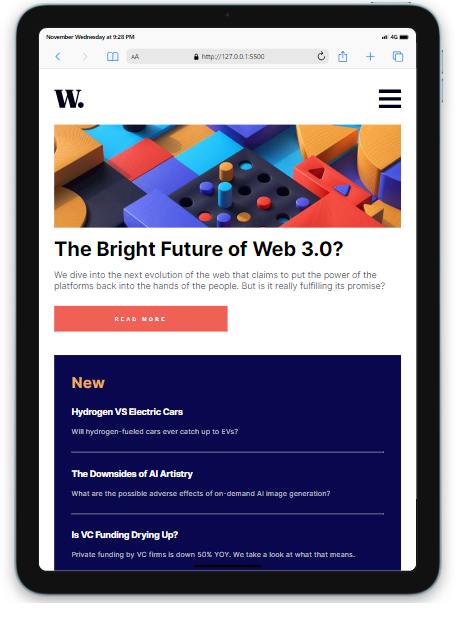
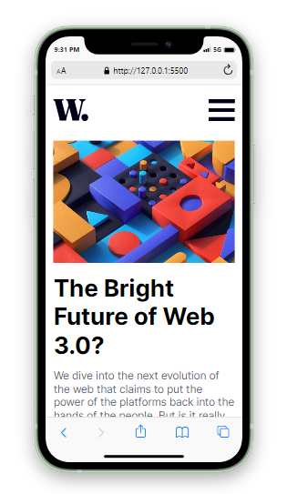
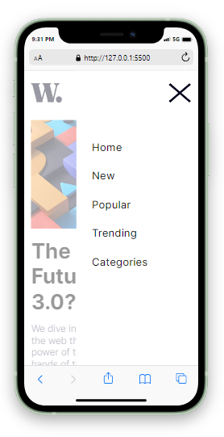

# News Homepage

## Table of contents

- [Overview](#overview)
  - [The challenge](#the-challenge)
  - [Screenshot](#screenshot)
  - [Built with](#built-with)
  - [What I learned](#what-i-learned)
- [Author](#author)


## Overview

This is an example news homepage made with HTML, CSS and a little JavaScript. The page structure
is created with CSS grid and uses JavaScript to control the menu change when screen size
reaches a certain size. 


### The challenge

Users should be able to:

- View the optimal layout for the interface depending on their device's screen size
- See hover and focus states for all interactive elements on the page
- See the mobile menu when viewing the site on a mobile or tablet


### Screenshot








### Built with

- HTML5
- CSS
- Grid / Flexbox
- JavaScript


### What I learned

I found this project very straight forward although it allowed me to
practice using CSS grids to create the layout. Which I then changed for 
a column flex display for mobile ad tablet. 

```css
.grid-con {
    display: grid;
    gap: 1.2rem;
    grid-template-columns: repeat(3, 1fr);
    grid-template-rows: 1.5fr 1fr 1fr;
}
```

## Author
- Lee Trewhitt
- Website - https://leetrw.github.io/


