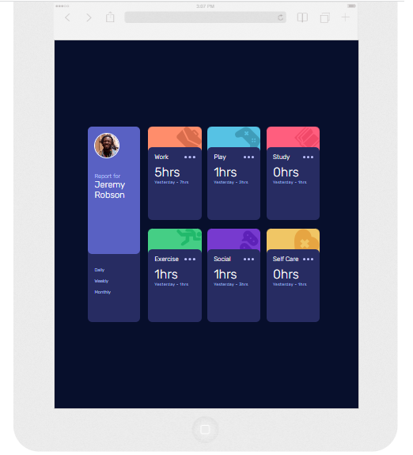

# Time Tracking Dashboard

## Table of contents

- [Overview](#overview)
  - [The challenge](#the-challenge)
  - [Screenshot](#screenshot)
  - [Built with](#built-with)
  - [What I learned](#what-i-learned)
- [Author](#author)


## Overview

This is a time tracking dashboard that is populated with data from a json file.
The user can switch between viewing the daily, weekly and monthly totals for
each category with the buttons below the profile. The dashboard will resize or 
change orientation depending on device size.  


### The challenge

Users should be able to:

- View the optimal layout for the site depending on their device's screen size
- See hover states for all interactive elements on the page
- Switch between viewing Daily, Weekly, and Monthly stats


### Screenshot

 
 
 
 
 
 


### Built with

- HTML5
- CSS
- Flexbox
- JavaScript


### What I learned

In this project I practiced fetching data from a JSON file and populating 
html elements with it. I used the forEach array method to go through all of 
the items in an array and add the correct data to the html in the
corresponding parts using their shared index. I also used the forEach method
to add and remove classes to control the visibility of the data on screen for
the three categories. 

```js
fetch('data.json')
    .then(response => response.json())
    .then(data => {
        dataArray.push(...data);
        populate();
    })

    function populate() {
               
        titles.forEach((title, i) => {
            title.innerHTML = dataArray[i].title;
        })

        daily.forEach((dailyDiv, i) => {
            const current = dailyDiv.querySelector('.current');
            const previous = dailyDiv.querySelector('.previous');
            current.innerHTML = dataArray[i].timeframes.daily.current + 'hrs';
            previous.innerHTML = 'Yesterday - ' + dataArray[i].timeframes.daily.previous + 'hrs';
            });
    }


    dailyButton.addEventListener('click', () => toggleView(daily));
    weeklyButton.addEventListener('click', () => toggleView(weekly));
    monthlyButton.addEventListener('click', () => toggleView(monthly));


    function toggleView(select) {

        const views = [daily, weekly, monthly];
        
        views.forEach((view) => {
            if(view == select) {
                select.forEach((div) => {
                    div.classList.remove('hide');
                })
            } else {
                view.forEach((div) => {
                    div.classList.add('hide');
                })
            }
        })
    }
```

## Author
- Lee Trewhitt
- Website - https://leetrw.github.io/


