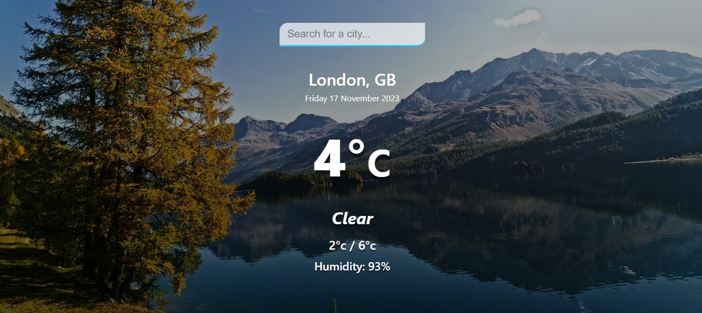

# Weather App

## Table of contents

- [Overview](#overview)
  - [The challenge](#the-challenge)
  - [Screenshot](#screenshot)
  - [Built with](#built-with)
  - [What I learned](#what-i-learned)
- [Author](#author)


## Overview

This is a webpage showing a weather app with a search bar for the user to find out
the current weather in a given city. It uses the 'open weather map' api to collect 
the data for the searched place and uses JavaScript to upack the information 
and display it to the user. The background will also change to match the weather in 
the searched city.


### The challenge

Users should be able to: 

- View the optimal layout for the component depending on their device's screen size
- Search for a city of their choice and see the current weather there
- See the background change to match all the major weather types


### Screenshot




### Built with

- HTML5
- CSS
- JavaScript


### What I learned

This project gave me a chance to practice using an API to populate a webpage
with information. I used a combination of functions to fetch the data and then
display it by accessing the relavent information inside the gathered object 
and populating the innerHTML of that element. 


```js
function getResults (query) {
    fetch(`${api.base}weather?q=${query}&units=metric&APPID=${api.key}`)
    .then(weather => {
        return weather.json();
    }).then((weather) => {
        displayResults(weather);
        changeBackground(weather);
});
}

function displayResults (weather) {
    console.log(weather);
    let city = document.querySelector('.location .city');
    city.innerText = `${weather.name}, ${weather.sys.country}`;

    let temp = document.querySelector('.current .temp');
    temp.innerHTML = `${Math.round(weather.main.temp)}<span>°c</span>`;
}
```

## Author
- Lee Trewhitt
- Website - https://leetrw.github.io/


